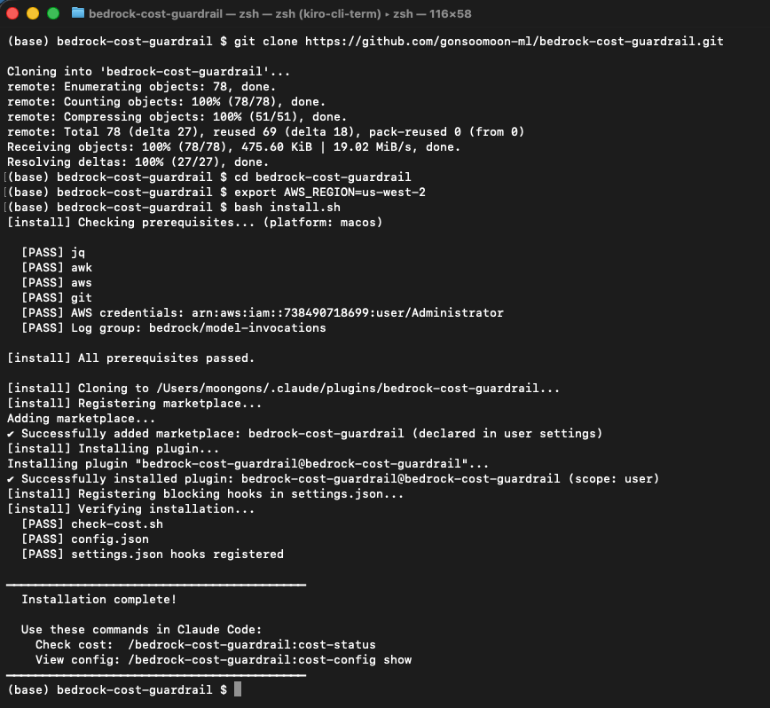
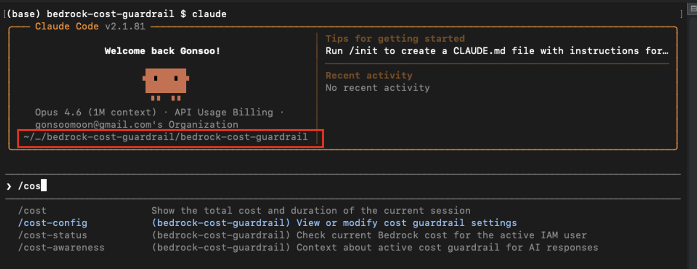
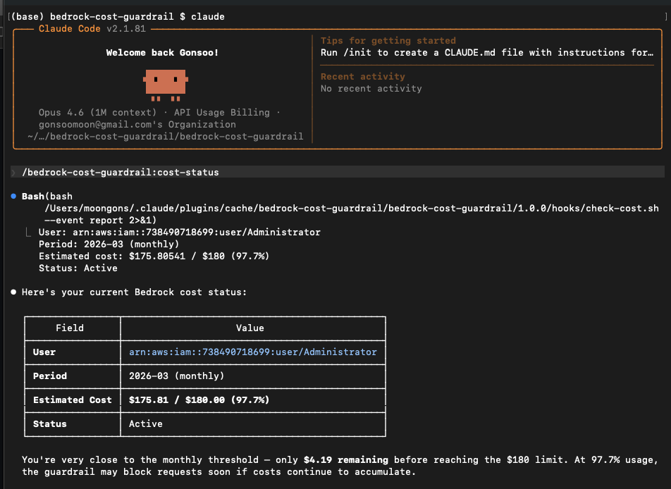
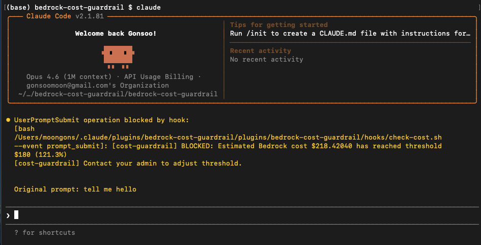
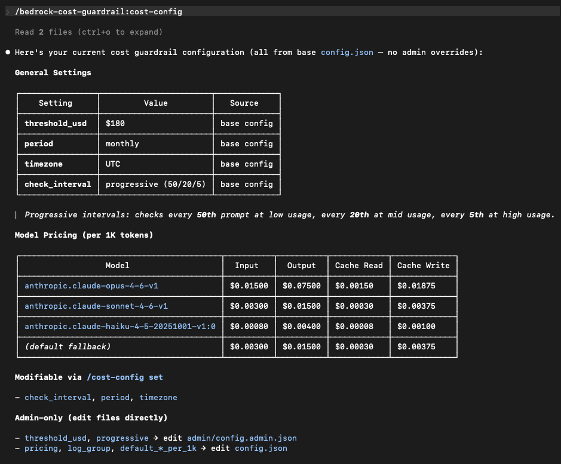
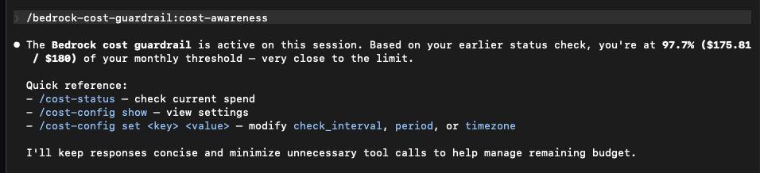

# Amazon Bedrock Cost Guardrail Plugin for Claude Code

IAM 사용자별 Amazon Bedrock API 비용을 모니터링하고, 설정된 임계값에 도달하면 Claude Code 사용을 자동 차단하는 플러그인입니다.

macOS, Linux, Windows (WSL/Git Bash)에서 동작합니다. 플랫폼 관련 문제가 발생하면 관리자에게 문의하세요.

## 사전 요구사항

- [Claude Code](https://claude.ai/code) 설치됨
- AWS CLI v2 설정됨 (관리자가 설정해야 합니다)
- Bedrock Model Invocation Logging 활성화됨 (관리자가 설정해야 합니다)

## 빠른 시작

### 1. 설치

> **터미널 열기:** macOS → Terminal 앱, Windows → Git Bash 앱, Linux → Terminal

    export AWS_REGION=<관리자에게 확인>    # Bedrock Model Invocation Logging이 활성화된 리전 (예: us-east-1, us-west-2, ap-northeast-2)
    curl -fsSL https://raw.githubusercontent.com/gonsoomoon-ml/bedrock-cost-guardrail/main/install.sh | bash

install.sh가 다음을 자동으로 처리합니다:
- 사전 요구사항 점검 (jq, awk, AWS CLI)
- 차단 훅 등록 (~/.claude/settings.json)
- 플러그인 검증

설치 후 Claude Code에서 `/cos`를 입력하면 플러그인 명령을 확인할 수 있습니다:

### 2. 비용 확인

    /bedrock-cost-guardrail:cost-status

### 3. 임계값 초과 시

비용이 임계값($200/월)에 도달하면 자동으로 차단됩니다.

## 기본 설정

설정을 조회하려면:

    /bedrock-cost-guardrail:cost-config show

> **참고:** 설정 변경은 관리자가 관리합니다. 직접 변경하지 마세요.

| 설정 | 기본값 | 설명 |
|------|--------|------|
| threshold_usd | $200 | 월간 차단 임계값 (관리자만 변경 가능) |
| period | monthly | 비용 집계 기간 |
| timezone | UTC | 기간 경계 시간대 |

## 동작 방식

세션 시작 시 비용 인식 컨텍스트가 자동으로 활성화됩니다:

- 세션 시작 시, 그리고 주기적으로 Bedrock 비용을 확인합니다
- CloudWatch Logs에서 모델별 토큰 단가로 비용을 계산합니다 (input, output, cache read, cache write)
- 설정된 임계값에 도달하면 사용을 차단합니다 (hard block)
- 모든 에러 상황에서 사용을 차단합니다 (fail-closed) — 비용 확인이 불가능한 상태에서의 무제한 사용을 방지합니다

## 문제 해결

**비용이 항상 $0으로 표시됩니다.**
→ 관리자에게 Bedrock Model Invocation Logging 활성화 여부를 확인하세요.

**임계값을 초과해도 차단되지 않습니다.**
→ `bash install.sh`를 다시 실행하세요.

**로그 그룹을 찾을 수 없습니다.**
→ AWS 리전이 올바른지 확인하세요: `export AWS_REGION=us-west-2` (관리자에게 리전을 확인하세요)

**오래된 데이터가 표시됩니다.**
→ `rm /tmp/claude-cost-guardrail-*` 실행 후 재시도하세요.

## 삭제

    bash uninstall.sh

## 소스

개발 저장소 및 상세 문서: [cost-guardrail-claude-code-bedrock](https://github.com/gonsoomoon-ml/cost-guardrail-claude-code-bedrock)
